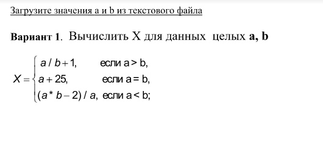
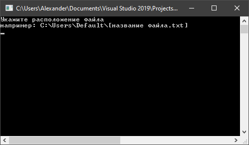

# Загрузите значения **a** и **b** из текстового файла

______________________________________________________

#### Вычислить **X** для данных целых **a**, **b** :

**Задача:**

> **X = a / b + 1**   если a > b,  
> **a + 25**          если a = b,  
> **(a * b - 2) / a** если a < b;

**Демонстрация:**

--
*подготовил Александр Усов*
